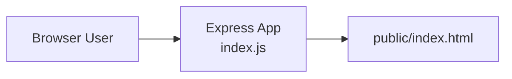

# Express Reliability Platform V1 — Local Foundation

## 1) Version Purpose

Build and run your first working reliability service on your computer, then create your own GitHub copy so you own the project from day one.

---

## Plain Language Context

**What is this version teaching you?**
You are setting up your workbench. Before any engineer at any company writes a single line of server code, they run it on their own computer first to prove it works. That is exactly what you will do here.

**How does a bank or hospital use this?**
Every new engineer joining a bank's technology team runs the platform locally on their laptop before they are allowed to touch any shared server. This ensures they understand how the system works without any risk of breaking something real.

**Key terms in plain language:**

| Term | What It Means |
|---|---|
| **Terminal** | A text window where you type instructions directly to your computer — like texting commands instead of clicking icons |
| **Node.js** | A program that lets your computer run JavaScript code — JavaScript is the language this project's API is written in |
| **npm** | Node's package manager — it downloads the software pieces your program needs, like an app store for code libraries |
| **localhost** | Your own computer's address — `http://localhost:3000` means "open port 3000 on this computer" |
| **Port** | A numbered door on your computer that programs listen on — port 3000 is where your app waits for browser requests |
| **GitHub** | A website that stores your code online, tracks every change, and lets you share your work with employers |
| **Git** | The tool on your computer that saves code history and pushes it to GitHub |
| **SSH Key** | A secure digital key that proves your identity to GitHub — safer than a password |

**Expected result at the end of this version:**
- Your browser opens `http://localhost:3000` and shows the app.
- Your code is visible at `https://github.com/YOUR_USERNAME/express-reliability-platform-v01`.

---


## Training Workflow (Understand -> Build -> Test -> Break -> Fix -> Explain -> Automate -> Improve)

1. Understand: Read `Version Purpose` and `Chapters Covered`.
2. Build: Complete the `Run Steps` exactly in order.
3. Test: Use the `Validation Checklist` and confirm expected output.
4. Break: Trigger one controlled failure (for example, stop the app process).
5. Fix: Use logs and terminal output to recover service.
6. Explain: Document what failed, why it failed, and what fixed it.
7. Automate: Add or improve scripts/checks so recovery is repeatable.
8. Improve: Re-run tests and tighten reliability and security settings.

## 3) What You Will Build

- A local Node.js Express service that responds in a browser.
- A personal GitHub repository for your V1 working baseline.

## 4) Architecture Diagram (Mermaid)



## 5) Project Structure

```text
express-reliability-platform-v01/
├── index.js
├── package.json
├── public/
│   └── index.html
└── README.md
```

## 6) Run Steps

1. Install tools: Node.js LTS, Git, and VS Code.
2. Open a terminal in this folder.
3. Install dependencies:

   ```sh
   npm install
   ```

4. Start the service:

   ```sh
   npm start
   ```

5. Open [http://localhost:3000](http://localhost:3000).

## 7) GitHub Account Setup and First Push

This section walks you from zero to a live GitHub repository. Complete it in order even if you already have a GitHub account — it also covers authentication best practices required for later versions.

### Step 1 — Create a GitHub Account

1. Go to [https://github.com](https://github.com) and click **Sign up**.
2. Enter your email address, create a password, and choose a username.
   - Use a professional username you are comfortable sharing with employers.
3. Verify your email address when GitHub sends the confirmation link.
4. On the welcome screen, choose **Free** plan.

### Step 2 — Configure Git on Your Machine

Open a terminal and set your identity. Git attaches this to every commit:

```sh
git config --global user.name "Your Full Name"
git config --global user.email "you@example.com"
```

Verify the configuration was saved:

```sh
git config --list
```

Expected output includes:

```text
user.name=Your Full Name
user.email=you@example.com
```

### Step 3 — Set Up Authentication (SSH Key)

GitHub requires authentication when you push code. The recommended method is an SSH key — it is more secure than typing a password each time.

**Generate a new SSH key:**

```sh
ssh-keygen -t ed25519 -C "you@example.com"
```

- Press **Enter** to accept the default file location (`~/.ssh/id_ed25519`).
- Enter a passphrase when prompted (recommended) or press **Enter** to skip.

**Start the SSH agent and add your key:**

```sh
eval "$(ssh-agent -s)"
ssh-add ~/.ssh/id_ed25519
```

**Copy your public key to the clipboard:**

```sh
cat ~/.ssh/id_ed25519.pub
```

Copy the entire output line.

**Add the key to GitHub:**

1. Go to [https://github.com/settings/keys](https://github.com/settings/keys).
2. Click **New SSH key**.
3. Give it a title (for example, `My Laptop`).
4. Paste the public key into the **Key** field.
5. Click **Add SSH key**.

**Test the connection:**

```sh
ssh -T git@github.com
```

Expected response:

```text
Hi YOUR_USERNAME! You've successfully authenticated, but GitHub does not provide shell access.
```

### Step 4 — Create a New Repository on GitHub

1. Click the **+** icon in the top-right corner of GitHub and select **New repository**.
2. Fill in the details:
   - **Repository name:** `express-reliability-platform-v01`
   - **Description:** `V1 — Local Express reliability service`
   - **Visibility:** Public (recommended for your portfolio)
   - **Do NOT** initialize with a README, `.gitignore`, or license — you already have these locally.
3. Click **Create repository**.
4. GitHub shows a page with push instructions. Keep this page open for the next step.

### Step 5 — Push V1 to GitHub

In your terminal, from inside the `express-reliability-platform-v01` folder:

```sh
git init
git add .
git commit -m "V1: local foundation — Express reliability service"
git branch -M main
git remote add origin git@github.com:YOUR_USERNAME/express-reliability-platform-v01.git
git push -u origin main
```

Replace `YOUR_USERNAME` with your actual GitHub username.

**Verify the push worked:**

```sh
git log --oneline
```

Then open your repository page on GitHub and confirm the files are visible.

### Step 6 — Protect the Main Branch (Best Practice)

Once V1 is pushed, set a branch protection rule so you never accidentally force-push over `main`:

1. Go to your repository on GitHub → **Settings** → **Branches**.
2. Click **Add rule** (or **Add branch protection rule**).
3. In **Branch name pattern**, type `main`.
4. Check **Require a pull request before merging**.
5. Click **Create**.

This is standard practice in every professional engineering team.

## 8) Validation Checklist

- [ ] `npm install` runs successfully with no errors.
- [ ] `npm start` starts the server without errors.
- [ ] Browser opens `http://localhost:3000` and shows the app.
- [ ] `git config --list` shows your name and email.
- [ ] `ssh -T git@github.com` responds with your GitHub username.
- [ ] Repository `express-reliability-platform-v01` is visible on your GitHub profile.
- [ ] `git log --oneline` shows your first commit.
- [ ] Branch protection rule is set on `main`.

## 9) Troubleshooting

- **Port in use:** stop the process on port 3000 (`lsof -i :3000` then `kill -9 <PID>`), then run again.
- **`npm` command not found:** reinstall Node.js LTS from [https://nodejs.org](https://nodejs.org).
- **Git push denied / Permission denied (publickey):** re-run `ssh -T git@github.com` and ensure the SSH key was added correctly to GitHub Settings → SSH Keys.
- **`remote: Repository not found`:** double-check the repository URL and that you created the repository in Step 4 before pushing.
- **Two-factor authentication prompt in browser:** GitHub 2FA does not affect SSH-based pushes — you only need the SSH key configured in Step 3.

## 10) Cleanup

- Press `Ctrl + C` to stop the local server.

## 11) Next Version Preview

In V2, you package this app with Docker and evolve from a single app into a 3-service platform structure (Node API, Flask API, Web UI).
